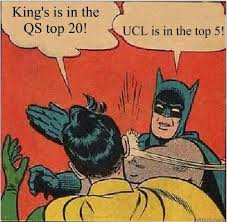
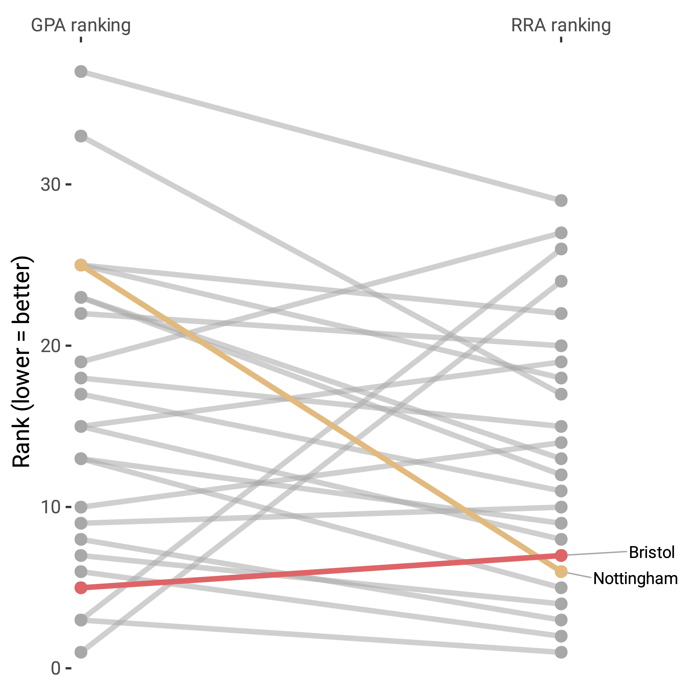
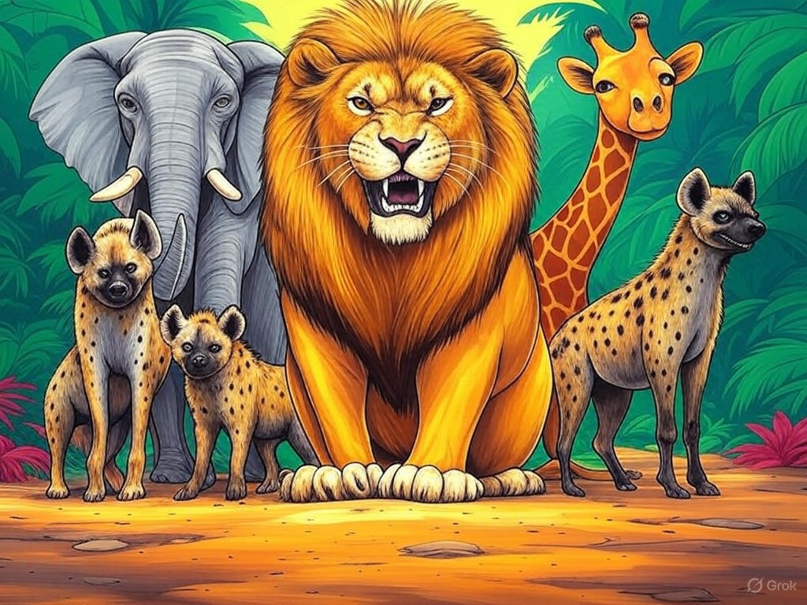
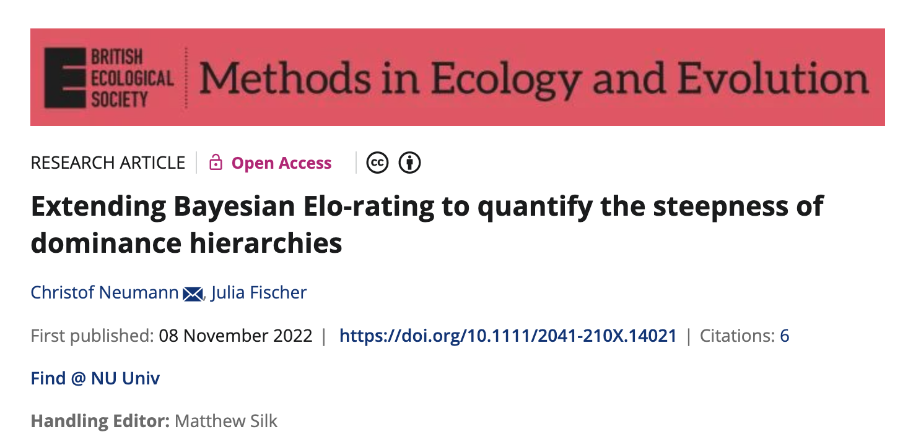
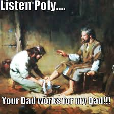
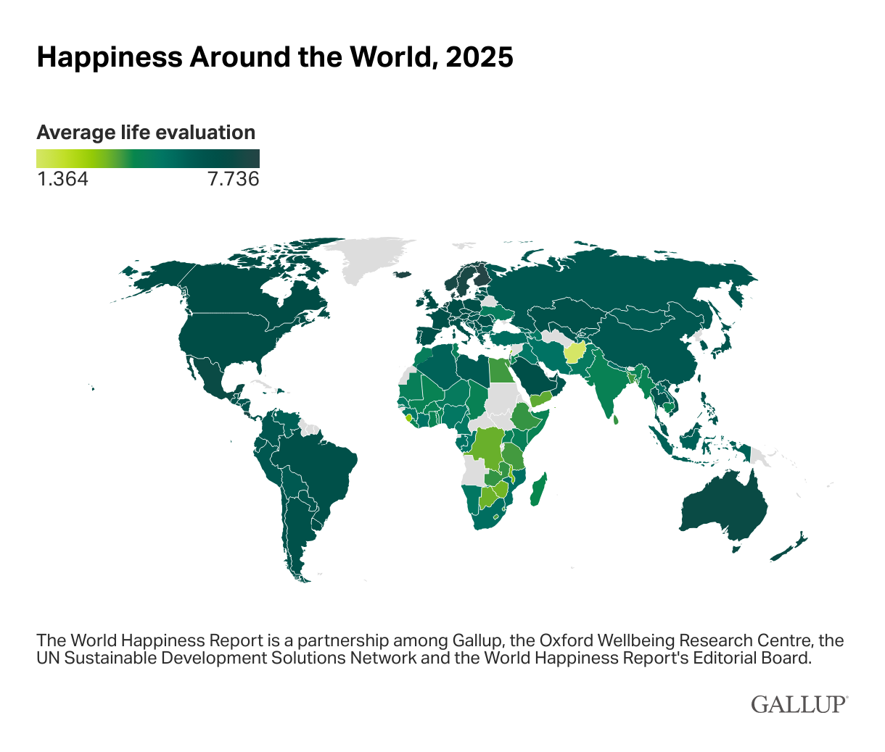
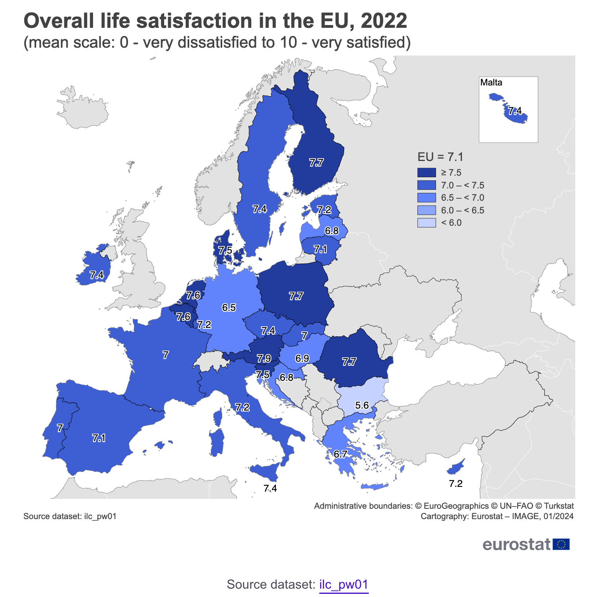
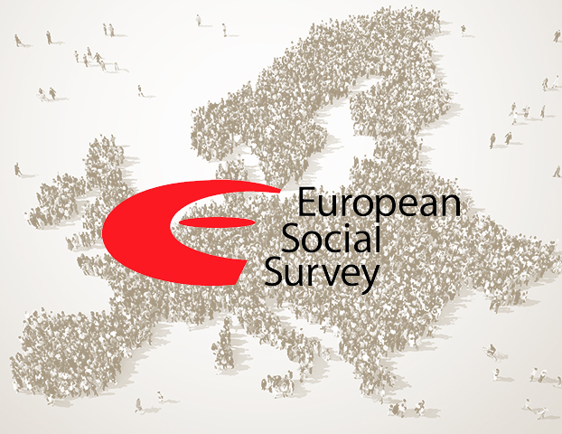
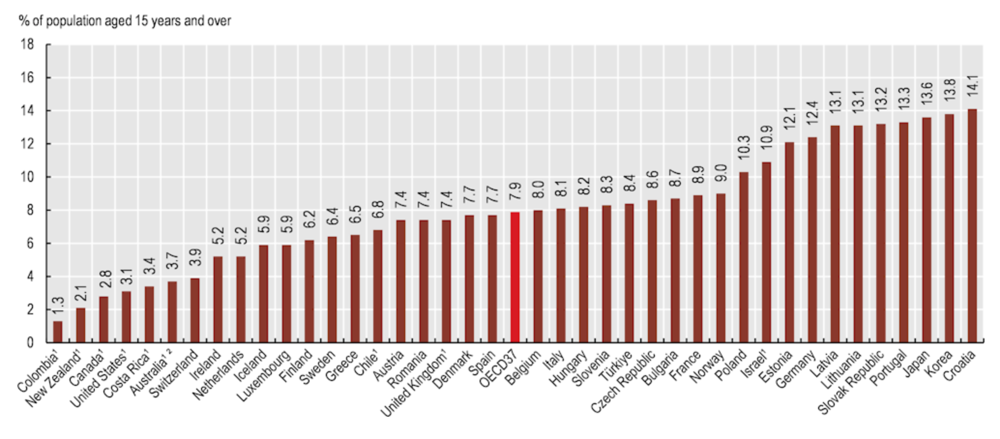
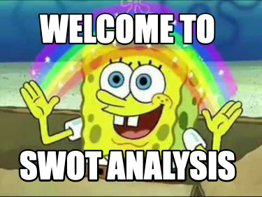

```{r setup, include=FALSE}
options(htmltools.dir.version = FALSE)
knitr::opts_chunk$set(echo = TRUE)
```

```{r echo=F, message=F, warning = F}
require(xaringanExtra) 
require(stargazer)
require(tidyverse)
require(knitr)
require(kableExtra)
require(DT)
```

```{r xaringan-logo, echo=FALSE}
xaringanExtra::use_logo("NU2.png")
```

```{r xaringan-tile-view, echo=FALSE}
xaringanExtra::use_tile_view()
# Below generates a new class of simulation table, as otherwise it will not fit.
```

```{css, echo = F}
table {
  font-size: 16px;     
}
```

```{css, echo = F}
.table_small table {
  font-size: 5.9px;     
}
```

```{css, echo = F}
.table_red table {
  font-size: 10px;     
}
```

## Today

An outline of what I am considering putting together as a grant.

```{r, out.width = "400px", echo=FALSE, fig.align='center'}
knitr::include_graphics("https://media.giphy.com/media/n6ljtq0aO6Zqg/giphy.gif") 
```

---
## Methodology

* I really, really like 'quirky' quantitative methods.

--

* Interested in metrics and rankings --> particular their uncritical use.

```{r, out.width = "400px", echo=FALSE, fig.align='center'}
knitr::include_graphics("https://media.giphy.com/media/v1.Y2lkPTc5MGI3NjExaXU0NmJqaHlrem5lYW1lZmpmOXp6amJwa2x1b211eW8za2dvZXR3dCZlcD12MV9pbnRlcm5hbF9naWZfYnlfaWQmY3Q9Zw/7rfwKxzvH22cg/giphy.gif") 
```

---
## Ubiquitous rankings

* Top Lists (Songs, Drafts in sports, Movies, Places to visit)

--

* University of the Year... . (Times Higher Education, QS, Shanghai)

--

* Happiest country / Healthiest country / etc.

```{r, out.width = "400px", echo=FALSE, fig.align='center'}
knitr::include_graphics("https://media.giphy.com/media/l2JecohhBypyIabXq/giphy.gif") 
```

---
## Found a hammer...

* [Robust Ranking Aggregation (RRA) Method](https://doi.org/10.1177/2515245923121861). 

--> Use case: Meta-analysis of gene lists. -- How to synthesise across many lists of varying length


```{r, out.width = "450px", echo=FALSE, fig.align='center'}
knitr::include_graphics("https://media.giphy.com/media/v1.Y2lkPTc5MGI3NjExZGxnczQyNXNlMTJucnYxODk3eXUxN3JiN3plamV1Yjl0b3NsamtjNCZlcD12MV9pbnRlcm5hbF9naWZfYnlfaWQmY3Q9Zw/10dHotK4K8R0AM/giphy.gif") 
```

---
## Current work on rankings

* [Preprint on Guardian and Complete University Guide rankings](https://osf.io/preprints/psyarxiv/fdkj5_v1) - discrepancies between institution and subject rankings.

--

* Working on draft on GPA rank in REF (Times Higher Education Rankings)

```{r, out.width = "350px", echo=FALSE, fig.align='center'}
 # from UCL meme FB group
```

???
Some correspondence! But not when it comes to movements up and down ... .

---
## Just a sliver from that working draft

GPA ranking (129 institutions) and a Robust Ranking Aggregation (RRA) method across units of assessment.

```{r, out.width = "400px", echo=FALSE, fig.align='center'}

```


---
## Target Leverhulme / ESRC secondary data analysis

* Expand on this work

--

* Pragmatically: I need to bring in some funds.

```{r out.width="400px", echo=F, fig.align="center"}
knitr::include_graphics("https://media4.giphy.com/media/v1.Y2lkPTc5MGI3NjExZWpya3hhdnFtbzZjeGo5c21yMzc1MDhzZ3ZpZDl4ZDRiY3NpM3BvZiZlcD12MV9pbnRlcm5hbF9naWZfYnlfaWQmY3Q9Zw/qi8Yhj4pKcIec/giphy.gif")
```


---
## Core idea

Let's use simulations to better understand the nature of rankings.

--

We will borrow from literature on animal dominance hierarchies. **Wait for it**

```{r out.width="350px", echo=F, fig.align="center"}

```


---
## Why? Rankings are typically sh*t

* Don't convey much information on gaps between top and bottom. Inequality

--

* Typically stationary -- movements hard to distinguish from noise?

--

--> We could do better as a lot of smart people have worked on how to generate rankings hierarchies!

---
## Animal hierarchy work

Three descriptors:

* **Steepness**:

Degree to which dominant individuals monopolize resources or control subordinates.

* **Linearity**: 

Each individual dominates those below and is subordinate to those above (A > B > C > D). Common in many species (e.g., wolves).

Non-linear: Some relationships violate the rules of transitivity (A dominates B, B dominates C, but C dominates A). (e.g., Chimpanzees, De Waal's (1982) chimpanzee's politics)

* **Temporal stability**: 

Frequent changes at the top versus rare changes.

---
## Elo Ratings 

* Arpad Elo in Chess.

--

* Elo system: skill can be represented by a single number, **a rating** 

--

* A higher rating --> greater skill. 

--

* Difference in ratings between two players predicts the expected probability of one defeating the other. 

--

After a game, ratings are updated based on the actual result compared to this expectation:

--

--> If you beat a stronger opponent, your rating increases more than if you beat a weaker one.
If you lose to a weaker opponent, your rating drops more than if you lose to a stronger one.

**Result:** a self-correcting system that converges toward a player’s true skill level over time.

---
## Common in 'sports' and e-sports

Sometimes these involve variations (Glicko / Glicko2 / Microsoft Trueskill).

* Chess / Go 

--

* E-sports (League of Legends, Halo, CS:GO)

--

Sports: Tennis, Football / Rugby, Badminton, etc

```{r, out.width = "350px", echo=FALSE, fig.align='center'}
knitr::include_graphics("https://media2.giphy.com/media/v1.Y2lkPTc5MGI3NjExMmRsNmFvY2p4c2d0Nm04cDA2a3c0MnhmaXF3NXJla2pnc2F0a3B4dyZlcD12MV9pbnRlcm5hbF9naWZfYnlfaWQmY3Q9Zw/t3sZxY5zS5B0z5zMIz/giphy.gif")
```

???
"_The core idea is that a rating alone doesn’t tell the full story—how confident we are in that rating matters too._" / Glicko-2 adds a third parameter: rating volatility ($\sigma$). This makes it even more sophisticated by modeling how much a player’s skill might fluctuate over time, addressing a key limitation of Glicko where skill was assumed to be relatively stable.

---
## An illustration

**Thomas opens Rstudio**

```{r out.width = "350px", echo=FALSE, fig.align='center'}
knitr::include_graphics("https://media0.giphy.com/media/v1.Y2lkPTc5MGI3NjExa3J6aGRqbHY4MGdiYWowd256ZnMyeWVzZnRyZ2JwYnRucmYwM3Z1cSZlcD12MV9pbnRlcm5hbF9naWZfYnlfaWQmY3Q9Zw/Y1f0mFqAAeNv9VJNgT/giphy.gif")
```

???
Built with AI in less than 1h

---
## Lots of work in this area... 

Likely I'll focus on `EloRatings` and `eloSteepness`

```{r out.width = "350px", echo=FALSE, fig.align='center'}

```

---
## My proposal

Examine hierarchies with an Elo rating approach in three domains:

* Universities based on Student satisfaction (NSS)

* Countries based on Happiness

* Countries based on self-rated health (?) --> Open to alternatives comparing hospitals? schools (OFSTED ratings)? Education in schools (PISA scores)

--> Mostly exploratory - does it change some narratives.

---
## National Student Survey

Via freedom of info requests I have obtained the **raw** data underpinning the NSS.

--> raw responses - depending on year some sociodemographics

```{r out.width = "350px", echo=FALSE, fig.align='center'}
knitr::include_graphics("https://media4.giphy.com/media/v1.Y2lkPTc5MGI3NjExdXFmYnVtZGx1cXozaHBuc3djMnZkdHFpaXc4MGxvdzZ4ZmVzMGhpMiZlcD12MV9pbnRlcm5hbF9naWZfYnlfaWQmY3Q9Zw/6901DbEbbm4o0/giphy.gif")
```

---
## NSS: Battle of the best

* Example of a single round: we sample a student response from psychology from Northumbria University and one from Newcastle university.

--

* We then randomly pick an NSS item which is scored 1 - 4 and the University with highest score gets the point. 

--

* repeat ad nauseam... . --> different institutions ; Like a chess or other tournament.

```{r, out.width = "300px", echo=FALSE, fig.align='center'}
 # from posh vs poly FB group
```

---
## NSS: Extensions

- We can impose further rules: e.g., full-time must play against full-time, same gender, etc. Or not specify those rules to see if it matters.

--

- Via manipulating the rules of the game we can gain insights into the limits of the system (clear win or no clear win, e.g. 2 points difference or only 1, etc)

```{r, out.width = "400px", echo=FALSE, fig.align='center'}
knitr::include_graphics("https://media0.giphy.com/media/v1.Y2lkPTc5MGI3NjExNTFiNTkxcjcyOWswZ2x6ZmV2ZDlmZjg5anZxeHVzbzlodjV3OWpxNCZlcD12MV9pbnRlcm5hbF9naWZfYnlfaWQmY3Q9Zw/4eB8YoyfzhG0mSEwWT/giphy.gif")
```

---
## Happiness / life satisfaction

Gallup has a world happiness report.

```{r, out.width = "450px", echo=FALSE, fig.align='center'}

```

source: [https://www.gallup.com/analytics/349487/world-happiness-report.aspx](https://www.gallup.com/analytics/349487/world-happiness-report.aspx)
---
## EU data

```{r, out.width = "450px", echo=FALSE, fig.align='center'}

```

source: [https://ec.europa.eu/eurostat/web/products-eurostat-news/w/ddn-20240115-1](https://ec.europa.eu/eurostat/web/products-eurostat-news/w/ddn-20240115-1)

---
## European Social Survey

Happiness
C1. Taking all things together, how happy would you say you are?

Extremely unhappy	
Extremely happy

00	01	02	03	04	05	06	07	08	09	10

Life Satisfaction
B20. All things considered, how satisfied are you with your life as a whole nowadays? Please answer using this card, where 0 means extremely dissatisfied and 10 means extremely satisfied.

Extremely dissatisfied	
Extremely satisfied

00	01	02	03	04	05	06	07	08	09	10

```{r, out.width = "200px", echo=FALSE, fig.align='center'}

```

---
## Self-rated health

**Adults rating their own health as bad or very bad, 2021 (or latest year)**

```{r, out.width = "450px", echo=FALSE, fig.align='center'}

```

source: [OECD, Health at a glance 2023](https://www.oecd.org/en/publications/health-at-a-glance-2023_7a7afb35-en/full-report/self-rated-health_ff2c161e.html)

---
## Data resource

[SHARE](https://share-eric.eu/search-results/result) : The Survey of Health, Ageing and Retirement in Europe (SHARE) 

A multidisciplinary, cross-national panel study focused on individuals aged 50 and older across 28 European countries and Israel. --> allows time component

```{r, out.width = "450px", echo=FALSE, fig.align='center'}
knitr::include_graphics("https://media4.giphy.com/media/v1.Y2lkPTc5MGI3NjExNnpoaHhudmp2c2VwYXRscGt0dG15NmoyNnY5cGpoanFzZGdjZWU5bSZlcD12MV9pbnRlcm5hbF9naWZfYnlfaWQmY3Q9Zw/xT9C25UNTwfZuk85WP/giphy.gif")
```

---
## Self-rated Health

**General Self-Rated Health (Global SRH)**
Question: "How would you rate your health in general?"
Response Options: Respondents choose from a five-point scale:
Excellent
Very Good
Good
Fair
Poor

--

**Comparison to Others (Relative SRH)**
Question: "How would you rate your health compared to other people your age?"
Response Options: Typically a five-point scale:
Much Better
Somewhat Better
About the Same
Somewhat Worse
Much Worse


???
Details: This is a standard single-item measure, asked consistently across all waves (e.g., Wave 1 in 2004 through Wave 9 in 2023). It captures an overall subjective assessment of health, reflecting physical, mental, and functional aspects as perceived by the individual. In some waves, particularly for U.S.-harmonized versions (aligned with the U.S. Health and Retirement Study), the question may be phrased as "Would you say your health is..." with the same response scale.

Details: This item appears in certain waves (e.g., Wave 1 and subsequent waves as part of the health module) and provides a relative perspective, allowing researchers to assess how individuals perceive their health in the context of their peers. It complements the global SRH by adding a comparative dimension.

---
## SHARE expansions

* Activities of Daily Living (ADL) and Instrumental Activities of Daily Living (IADL)

--

* Mental health measure (Euro-D)

--

* Questions about conditions

--

* Health behaviour (smoking, drinking, exercise, etc)

```{r, out.width = "450px", echo=FALSE, fig.align='center'}
knitr::include_graphics("https://media1.giphy.com/media/v1.Y2lkPTc5MGI3NjExYmc0ZmY2bzVuZWt0NDdnZnRsNXo5bTUzbXNzenRmMHZwZXM2OTRxaSZlcD12MV9pbnRlcm5hbF9naWZfYnlfaWQmY3Q9Zw/GSE1BzJG4JVbq/giphy.gif")
```


---
## SWOT --> Thomas is disgusted with himself...

* **Strengths**: Novel technique / cross-fertilisation, relatively assumption free?

--

* **Weaknesses**: 'Garbage in, Garbage out', small samples lead to pseudoreplication, Controversial?,

--

* **Opportunities**: Make some 'Shiny' Visualisations, other datasets (ELSA, etc), ... .

--

* **Threats**: Finding someone who will like this? / replacing ranking with someone else

```{r, out.width = "200px", echo=FALSE, fig.align='center'}

```

---
## Moving forward... 

* More awareness of limitations of rankings?

```{r, out.width = "450px", echo=FALSE, fig.align='center'}
knitr::include_graphics("https://media.giphy.com/media/3ohc0PrdNeYvAzGa76/giphy.gif")
```


---
## Any Questions?

[http://tvpollet.github.io](http://tvpollet.github.io)

Twitter: @tvpollet

```{r, out.width = "600px", echo=FALSE, fig.align='center'}
knitr::include_graphics("https://media.giphy.com/media/3ohzdRoOp1FUYbtGDu/giphy.gif")
```

---
## Acknowledgments

* I am greatly indebted to my collaborators (Or I will be ;)). (Any mistakes are my own!).

* You for listening!

```{r, out.width = "500px", echo=FALSE, fig.align='center'}
knitr::include_graphics("https://media.giphy.com/media/10avZ0rqdGFyfu/giphy.gif")
```


